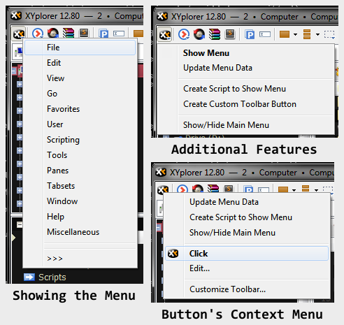

# Main Menu in a Script

**Provides the ability to display [XYplorer](http://xyplorer.com/index.php)'s main menu wherever a script can be called.**

This script generates a menu nearly identical to XYplorer's main menu including the localized translation and most accelerator keys thus allowing you to display the main menu anywhere that a script can be run, such as catalog entries, toolbar buttons, or even via a keyboard shortcut.

#### Features
+ **Always Up-to-Date**

 The menu is generated from the data available in XYplorer's _Help_ > _List All Commands_ dialog - ensuring it is always correct for the current and future version of XYplorer.

+ **Easy to Use**

 This script is able to automatically add a custom toolbar button for you or generate a calling script that can be added to your catalog or user-defined commands.

+ **Flexible**

 All of the data used to display the menu is seamlessly cached between uses in either an INI file or permanent variables - depending on your configuration and desires.

#### Known Limitations
+ This script cannot produce a stateful copy of the main menu. As a result main menu items that are checked or disabled do not show as show in the generated script. Nor are the items grouped with separators.
+ While this script can display the localized menu titles (File, Edit, View...) it cannot retrieve the proper accelerator keys assigned to them. Instead it will attempt to assign them automatically to the first available letter.

----------

#### Usage
1. [Download](./MainMenu.xys?raw=true)
2. Run
3. Follow the prompts to generate the main menu.
4. [Optional] Select _>>>_ and then _Create Custom Toolbar Button_ to add the script to your toolbar.

#### Requires
+ XYplorer with scripting enabled.

#### Tested On
+ Microsoft Windows 7 Professional SP1 x64
+ XYplorer v12.80.0000

#### Notes
+ Developed in response to this [wish](http://www.xyplorer.com/xyfc/viewtopic.php?p=89396#p89396).
+ Discussion [thread](http://www.xyplorer.com/xyfc/viewtopic.php?f=7&t=10135) in XYplorer's Forums.
+ Developed by [TheQwerty](https://github.com/TheQwerty) - [contact](http://www.xyplorer.com/xyfc/memberlist.php?mode=viewprofile&u=438) me.

----------

#### Release Notes
+ v 1.1 - August 29, 2013
    - Made CTB icon '&lt;xypath&gt;\\&lt;xyexe&gt;'.
+ v 1.0 - August 27, 2013
    - Initial Release

----------

_This is an unofficial script file for [XYplorer](http://xyplorer.com/index.php) - a powerful file manager for Windows.
It has been released by a group of individuals under the collective organization name [XYplorer-Scripts](https://github.com/XYplorer-Scripts)._

